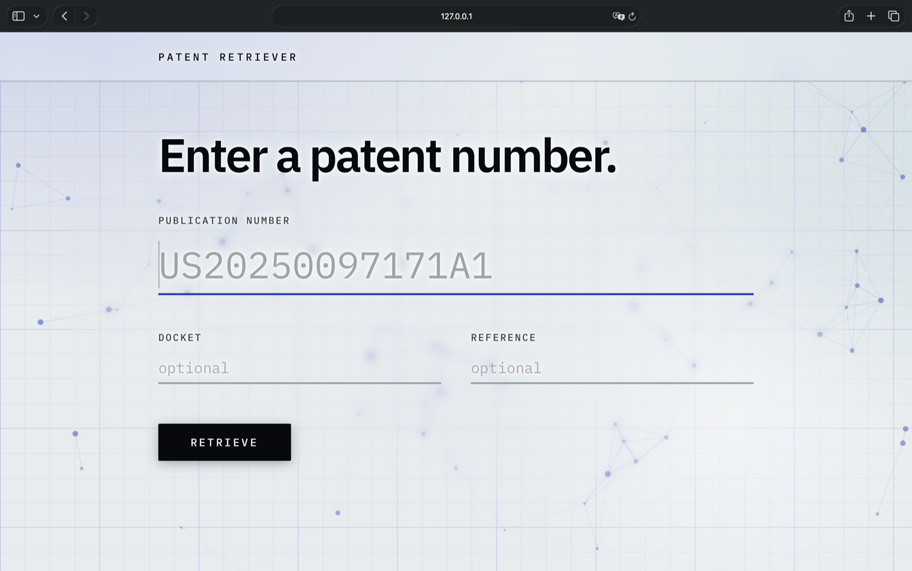
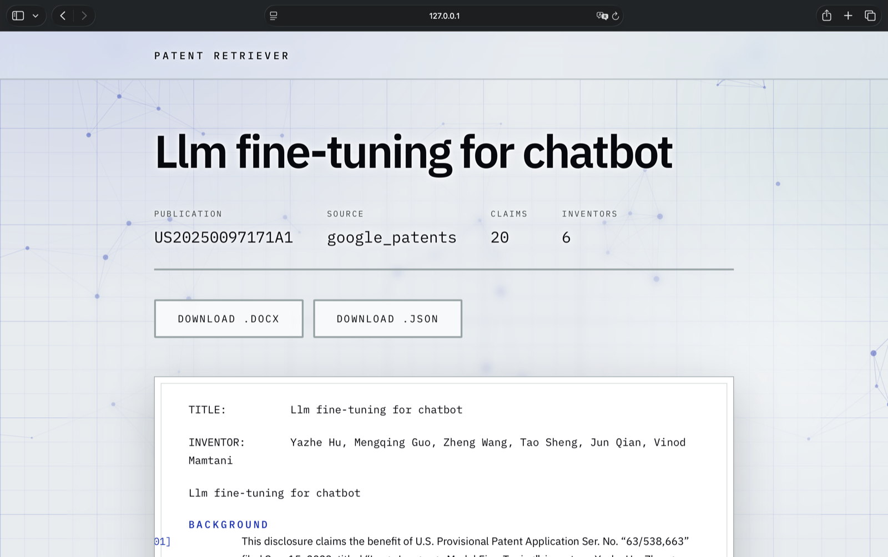

[](https://github.com/zunecs/patent-retriever/actions/workflows/ci.yml)

# Patent Retriever

Retrieves patent documents from external sources, normalizes them into a single
internal model, and generates the `.docx` format required by a patent
translation tool — plus a JSON representation of the same data.

**This application does not perform translation.** It prepares the input.





---

## Why it exists

Preparing a patent for translation meant copying title, abstract, claims, and
description out of a patent database by hand, then reformatting the result to
match a strict document template. That is slow and error-prone, and the errors
are invisible until the translation comes back wrong.

This tool does it in one command.

## What it does

```bash
patent-retriever fetch US20250097171A1 --docket ABC-1234567 --client-ref REF-000123
```

```
Retrieved US20250097171A1 from google_patents
  output/US20250097171A1.docx
  output/US20250097171A1.json
```

There is also a web interface for previewing a document before downloading it:

```bash
python -m patent_retriever.interfaces.web.app
```

---

## Design

Dependencies point inward. The core knows nothing about HTTP, HTML, Word, or
Flask, which is what makes each layer independently testable and each source
replaceable.

```
CLI   ─┐
       ├─→  RetrievalService  ─→  Sources (Google Patents, EPO OPS)
Flask ─┘          │                      │
                  │                      └─→  SectionMapper
                  ├─→  Renderers (.docx, JSON)
                  └─→  Domain (PatentDocument)
```

| Package | Responsibility |
|---|---|
| `domain/` | `PatentDocument`, section mapping, exception hierarchy. No I/O, stdlib only. |
| `sources/` | One adapter per source, each implementing `fetch(number) -> PatentDocument`. |
| `services/` | The fallback chain and the policy for what counts as a complete document. |
| `renderers/` | `PatentDocument` → `.docx` bytes or JSON. Never fetches anything. |
| `interfaces/` | CLI and Flask. Deliberately thin — delete either and the other still works. |

### Decisions worth explaining

**Adding a source touches two files.** A new adapter in `sources/`, and one line
in `sources/registry.py`. The service never learns that it exists — sources are
injected, never imported.

**Completeness is a service concern, not a source concern.** A source returns a
document or raises. Whether the result is good enough to stop looking is a
policy decision, and policy belongs in one place.

**The domain model is immutable.** `PatentDocument` is a frozen dataclass holding
tuples, validated at construction. Invalid documents cannot exist, so no
downstream code defends against missing titles or empty claim lists.

**Presentation lives in the renderer.** The model stores paragraph numbers as
integers; the four-digit bracketed form belongs to the `.docx` and would be
noise in the JSON.

**Four-digit list numbering needed raw XML.** Word cannot zero-pad list numbers
to four digits through any built-in format, and python-docx has no API for
numbering definitions, so the renderer injects an ECMA-376 `custom` format
directly into `numbering.xml`.

---

## Installation

Requires Python 3.11+.

```bash
git clone <https://github.com/zunecs/patent-retriever>
cd patent-retriever
python -m venv .venv
source .venv/bin/activate          # Windows: .venv\Scripts\activate
cp .env.example .env
```

Then pick one:

```bash
pip install .            # to use the tool
pip install -e ".[dev]"  # to work on it — includes tests, linting, type checking
```

With the plain install, re-run `pip install .` after changing any code.
Tests always read `src/` directly and are unaffected.

## Configuration

All settings come from environment variables; see `.env.example`.

| Variable | Default | Purpose |
|---|---|---|
| `PATENT_SOURCE_ORDER` | `google_patents` | Comma-separated source priority |
| `HTTP_TIMEOUT_SECONDS` | `20` | Per-request timeout |
| `OUTPUT_DIR` | `./output` | Where generated files are written |
| `EPO_OPS_KEY` / `EPO_OPS_SECRET` | — | EPO OPS credentials |

### EPO OPS setup

Google Patents needs no credentials and works out of the box. EPO Open Patent
Services is an official authenticated API and is the better source for EP and WO
documents, but it has to be registered for:

1. Create a free account at [developers.epo.org](https://developers.epo.org/).
2. Under **My Apps**, create an app. OPS issues it a *Consumer Key* and a
   *Consumer Secret*.
3. Put both in `.env`:

   ```
   EPO_OPS_KEY=your-consumer-key
   EPO_OPS_SECRET=your-consumer-secret
   PATENT_SOURCE_ORDER=epo_ops,google_patents
   ```

Both variables are required. If `epo_ops` is in the source order and either is
missing, the tool exits with code `4` and names the variable rather than failing
at request time. Authentication is OAuth2 client credentials; the access token is
cached and reused across the three calls a retrieval makes.

## Usage

```bash
patent-retriever fetch US20250097171A1          # both formats
patent-retriever fetch US20250097171A1 --json-only
patent-retriever fetch US20250097171A1 -v       # show which sources were tried
patent-retriever fetch EP3000001A1              # EP and WO work best via epo_ops
patent-retriever sources                        # list configured sources
```

Exit codes: `0` success, `2` malformed patent number, `3` not found in any
source, `4` configuration error.

## Development

```bash
python -m pytest -q     # tests
mypy                    # static typing, strict
ruff check .            # linting
ruff format .           # formatting
```

Tests never touch the network. Source parsers run against saved fixtures in
`tests/fixtures/` — HTML for Google Patents, JSON captured from live OPS by
`scripts/check_epo.py` for EPO. HTTP error handling and token caching are tested
with `respx`. Re-run `scripts/check_epo.py` rather than hand-editing a fixture.

---

## Output format

The generated document follows a strict template specified in
[`docs/output-format.md`](docs/output-format.md) — measured from a real sample
rather than guessed. Times New Roman 13 pt, 1.5 spacing, justified body, a
running page header, and genuine Word list numbering for paragraph IDs.

## Known limitations

- **Google Patents is scraped, not queried through an API.** It has no public
  API. Scraping is fragile and subject to their terms of service; the source
  order is configurable so another source can be promoted without code changes.
- **EPO OPS full text covers EP and WO documents, not US ones.** OPS serves
  bibliographic data for US patents but answers `CLIENT.InvalidCountryCode` for
  their claims and description. US patents therefore fail on EPO OPS and rely on
  Google Patents, which is what the fallback chain is for. Putting `epo_ops`
  first costs one wasted request per US patent and nothing else.
- **EPO full text is not always in English.** OPS returns claims and description
  per language, and some EP documents have no English variant of one of them —
  EP3000001 serves English claims but a French-only description. The other
  language is used and a warning is logged naming it, because discarding the
  description would be worse; this tool prepares input for translation.
- **EPO descriptions usually carry no headings.** OPS text-only full text has no
  markup for them, so the section mapper has nothing to split on and the whole
  description lands under `BACKGROUND`. EPO-sourced documents are consequently
  reported as missing `detailed_description`.
- **The output template is US-specific.** Non-US patents render into a document
  that says `UNITED STATES LETTERS PATENT`.
- **The web interface caches results in process memory.** Fine for a single-user
  internal tool; a multi-worker deployment would need a shared cache.

## Licence

MIT — see [LICENSE](LICENSE).